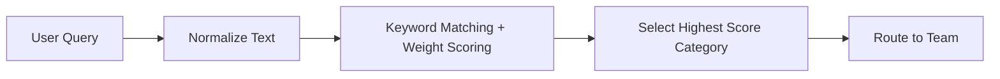

# Pattern: Ticket Routing & Priority Classification

## Problem

Customer support tickets or internal issues need to be classified and routed efficiently.
Manual routing or complex ML models can be costly and slow.

## When to Use:

1. Small-to-medium businesses with predictable ticket categories
2. When you want a low-cost deterministic solution first
3. As a fallback or hybrid system with AI-enhanced scoring

## Pattern Overview:



    
## How the Pattern Works

1. *Input:* Receive the ticket content (customer complaint or issue).
2. *Normalization:* Convert text to lowercase for uniform matching.
3. *Scoring:*
     - For each category, compare ticket text against its keywords.
     - Add category keyword weights for each match.
4. *Selection:* Choose the category with the highest total score.
5. *Routing:* Map the category to the correct team (e.g., Support Level 1, Level 2, Backlog).
6. *Output:* Return:
    - `:category` → predicted ticket category
    - `:confidence` → total score (combined weight for matched keywords)

## Benefits:

1. Fast and predictable
2. Easy to explain
3. Minimal infrastructure and cost
4. Can integrate AI scoring later if needed

## Reference Implementation (Ruby):

*See File:* [example-ruby/run.rb](example-ruby/run.rb)

This file contains a reusable method `route_ticket(text)` that takes a customer complaint or query as input and returns:

 - `:category` → predicted ticket category
 - `:confidence` → combined weight score indicating match strength

## Example usage:
```
route_ticket("I was charged twice and need a refund")
# => { category: :billing, confidence: 1.2 }
```

Running the file prints the category and confidence for each query, demonstrating the pattern in action.

Algorithm Sketch:

- Take ticket content as input
- Convert text to lowercase
- Match keywords from each category and sum their weights
- Identify the category with the highest total score
- Return category and confidence score

## How to Use

1. Copy run.rb to your project or reference it directly
2. Call route_ticket(text) with your customer query
3. Optionally adjust TICKET_RULES weights or keywords for your business
4. Use the results to route tickets automatically

## Contributing 🤝

 - Open issues for feature requests or improvements
 - Submit PRs with tests or documentation updates
 - Keep solutions pragmatic, deterministic, and cost-aware
   
## Maintainer

Maintained by Buvanesh. Contributions and discussions are welcome ❤️
